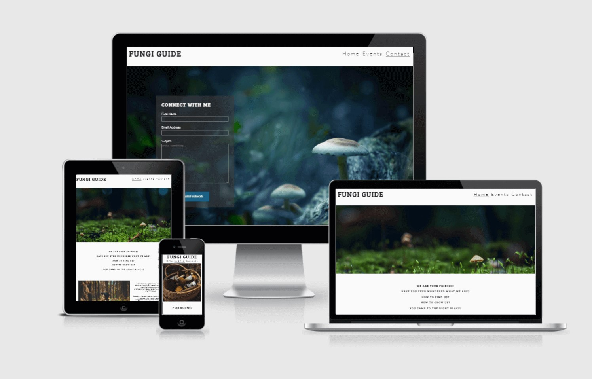

<h1 align="left">Fungi Guide</h1>

[View the live project here.](https://macannadev.github.io/fungi-guide/)

Fungi guide is a website that enables users to connect with Elina who offers workshops and guidance related to fungi.
<h2 align="center"></h2>

## User Experience (UX)

-   ### User story

      1. I want to learn what the website contains, whether I like it or not and the if its what I am looking for.

      2. I want to get to know the person whos business it is to know if I want to engage further.

      3. I want to validate their capabilities by assessing there social media presence.

      4. I want to know what is being uniquely offered here.

      5. I want to contact the owner to learn more and connect.


 -  ### Business story

       - I want to introduce myself to the customer.I want to make them feel like they can reach out to me and that I am approachable so they can see themselves coming to my events.

- ### Design

    -   #### Typography
        -   The logo, and headers sized text uses Bree Serif with serif as a fall back.
        Bree serif is described as friendly upright italic, which suits the UX intention to create a approachable and friendly impression.
    -   #### Images
        -   The large images on the main and from pages are attempting to create a sense of place where the user would like to be.
        -   The profile image associates a person with that place and further develops this theme.
        -   The events image portray what the events is about in the form of an image.

*   ### Wireframes

    -   Desktop Wireframe - [View](/readme-files/wireframes/wireframes-desktop.pdf)
    -   Mobile Wireframe - [View](/readme-files/wireframes/wireframe-desktop.bmpr)

## Features


1. **Contact Form**  - a form that allows people interested in Elina's work to contact her.

2. **Social media links** - links in the footer that allow users to find her social media accounts.


## Future Features
   
   1. **Testimonial** - I would add a scrolling testimonial at the end of the home page in order to reinforce people opinion of Elina through social proof. I would use [owl carousel](https://owlcarousel2.github.io/OwlCarousel2/) for this.

   2. **Shop page**- I would create a new page to sell mushroom powders used as health supplements

   3. **Identification pdf** - I would add a link to a pdf with identification tips.


### Languages Used

-   [HTML5](https://en.wikipedia.org/wiki/HTML5)
-   [CSS3](https://en.wikipedia.org/wiki/Cascading_Style_Sheets)

### Frameworks, Libraries & Programs Used


1. [Google Fonts:](https://fonts.google.com/)
    - Google fonts were used to import the 'Bree serif' and Lato fonts into the style.css file 
    .
1. [Font Awesome:](https://fontawesome.com/)
    - Font Awesome was used to create social media footers.

1. [Git:](https://git-scm.com/)
    - Git was used for version control by utilizing the Gitpod terminal to commit to Git and Push to GitHub.
1. [GitHub:](https://github.com/)
    - GitHub is used to store the projects code after being pushed from Git.
    
1. [Balsamiq:](https://balsamiq.com/)
    - Balsamiq was used to create the wireframes during the design process.

1. [Tinypng:](https://tinypng.com/)
    - Tinypng allowed me to compress the images, which allowed the website to load faster, increasing its performance rating.


## Testing
### Code Validation

The W3C Markup Validator and W3C CSS Validator Services were used to validate the project.

-   [W3C Markup Validator](https://jigsaw.w3.org/css-validator/#validate_by_uri) - [Results](readme-files/readme-images/validator-w3.png)
-   [W3C CSS Validator](https://jigsaw.w3.org/css-validator/#validate_by_uri) - [Results](readme-files/readme-images/css-validator.png)

### Lighthouse testing

The website was tested for both mobile and desktop in three browsers
- [Chrome mobile results](readme-files/readme-images/chrome-lighthouse-mobile.png)
- [Chrome desktop results](readme-files/readme-images/chrome-lighthouse-desktop.png)

- [Edge mobile results](readme-files/readme-images/edge-lighthouse-mobile.png)
- [Edge desktop results](readme-files/readme-images/edge-lighthouse-desktop.png)

- [Mozilla mobile results](readme-files/readme-images/mozilla-lighthouse-mobile.png)
- [Mozilla desktop results](readme-files/readme-images/mozilla-lighthouse-desktop.png)

### Testing User Stories from User Experience (UX) Section


 
1.   I want to learn what the website contains, whether I like it or not and the if its what I am looking for.
    
     - The nav bar shows the available pages with names that clearly portray their contents

     - The hero image shows a mushroom growing ina pleasant landscape which lets the user know they are on a site that is about mushrooms.

2.  I want to get to know the person who's business it is to know if I want to engage further.

    - The profile image presents an image of the website owner that expresses her individuality and an aesthetic that they may find appealing.

    - The profile text gives the user some information about Elinas expertise and personality.

       
    - I want to validate their capabilities by assessing there social media presence.
      
       1.The social media footer contains links to social media presence
        

3. I want to know what is being uniquely offered here.
       
     - The profile text outlines Elina's unique backround which is a mixture of a love of science and being in nature.

     - The events page outlines the various ways in which Elina can be of service to people.
     


4. I want to contact the owner to learn more and connect.

     - The social media links allow users to follow her on their platforms.

     - The form on the contact page provides a means for users to connect with her
  


### Further Testing

 1. Contact form

      -  Press submit when text fields are blank, wich results in a pop requesting that the field be filed.

      -  Type text that is not an email address into email text box and the pop up returns requesting that the field  be filed.

      - Fill out the form, submit and then I am guided to a thank you page.


 2. Social media links

      - When the links are clicked on each page they bring the user to the appropriate site.
    


## Deployment

To deploy a website on GitHub Pages, follow these steps:

   1. Go to the repository page

   2. Click on settings icon in the top of the page
   
   3. Find "GitHub Pages" section

   4. Click on the "Source" dropdown menu

   5. Select "master branch" option

   6. A green success message should appear in the "GitHub Pages" section with the link to the live preview of the project.

### GitHub Pages

The project was deployed to GitHub Pages using the following steps...

 1. Log in to GitHub and locate the [GitHub Repository](https://github.com/)
 2. At the top of the Repository (not top of page), locate the "Settings" Button on the menu.
    - Alternatively Click [Here](https://raw.githubusercontent.com/) for a GIF demonstrating the process starting from Step 2.
 3. Scroll down the Settings page until you locate the "GitHub Pages" Section.
 4. Under "Source", click the dropdown called "None" and select "Master Branch".
 5. The page will automatically refresh.
 6. Scroll back down through the page to locate the now published site [link](https://github.com) in the "GitHub Pages" section.

### Forking the GitHub Repository

By forking the GitHub Repository we make a copy of the original repository on our GitHub account to view and/or make changes without affecting the original repository by using the following steps...

1. Log in to GitHub and locate the [GitHub Repository](https://github.com/)
2. At the top of the Repository (not top of page) just above the "Settings" Button on the menu, locate the "Fork" Button.
3. You should now have a copy of the original repository in your GitHub account.

### Making a Local Clone

1. Log in to GitHub and locate the [GitHub Repository](https://github.com/)
2. Under the repository name, click "Clone or download".
3. To clone the repository using HTTPS, under "Clone with HTTPS", copy the link.
4. Open Git Bash
5. Change the current working directory to the location where you want the cloned directory to be made.
6. Type `git clone`, and then paste the URL you copied in Step 3.

```
$ git clone https://github.com/YOUR-USERNAME/YOUR-REPOSITORY
```

7. Press Enter. Your local clone will be created.

```
$ git clone https://github.com/YOUR-USERNAME/YOUR-REPOSITORY
> Cloning into `CI-Clone`...
> remote: Counting objects: 10, done.
> remote: Compressing objects: 100% (8/8), done.
> remove: Total 10 (delta 1), reused 10 (delta 1)
> Unpacking objects: 100% (10/10), done.
```

Click [Here](https://help.github.com/en/github/creating-cloning-and-archiving-repositories/cloning-a-repository#cloning-a-repository-to-github-desktop) to retrieve pictures for some of the buttons and more detailed explanations of the above process.

## Credits

### images

 - [Foraging basket](https://www.pexels.com/photo/brown-wooven-basket-74510/)

 - [Cooking](https://www.pexels.com/photo/person-holding-a-mushroom-5662357/)

 - [Woman in the forest](https://pxhere.com/en/photo/84714)

 - [404 dog](https://unsplash.com/photos/gySMaocSdqs)

 - [Hero mushroom on moss](https://www.pexels.com/photo/shallow-photography-of-yellow-mushroom-on-moss-1643402/)

 - [Contact page mushroom](https://www.pexels.com/photo/white-mushrooms-digital-wallpaper-733116/)

 - [Identify mushroom in hand](https://pxhere.com/en/photo/944357)

 - [Mushroom cultivation image](https://commons.wikimedia.org/wiki/File:Panaeolus-cyanescens-y-axis-flipped.jpg)

 - All of the above images have been altered by me to some degree and are not representitive of the originators work or intentions.

 - These images are not being used for commercial purposes
 


### Code

- [Love running walk through by code insitute - social media footer and  form](https://github.com/MACANNAdev/loverunning) 

- [Form code submit](https://www.w3schools.com/howto/howto_css_contact_form.asp)

- [Responsive design tutorial](https://www.w3schools.com/css/css_rwd_intro.asp)

- [Nav alignment flex solution](https://stackoverflow.com/questions/20920265/horizontal-menu-how-to-float-right-but-keep-the-menu-items-in-the-correct-order)

- [404 page](https://draft.dev/learn/github-pages-404)

- [Code institute Readme basic outline](https://github.com/Code-Institute-Solutions/SampleREADME)

- [Markdown](https://github.com/adam-p/markdown-here/wiki/Markdown-Cheatsheet#links)

-  All text content was written by the developer.

### Acknowledgements

-   My Mentor for Antonio Rodriguez for helpful advice on what to do and what not to do.